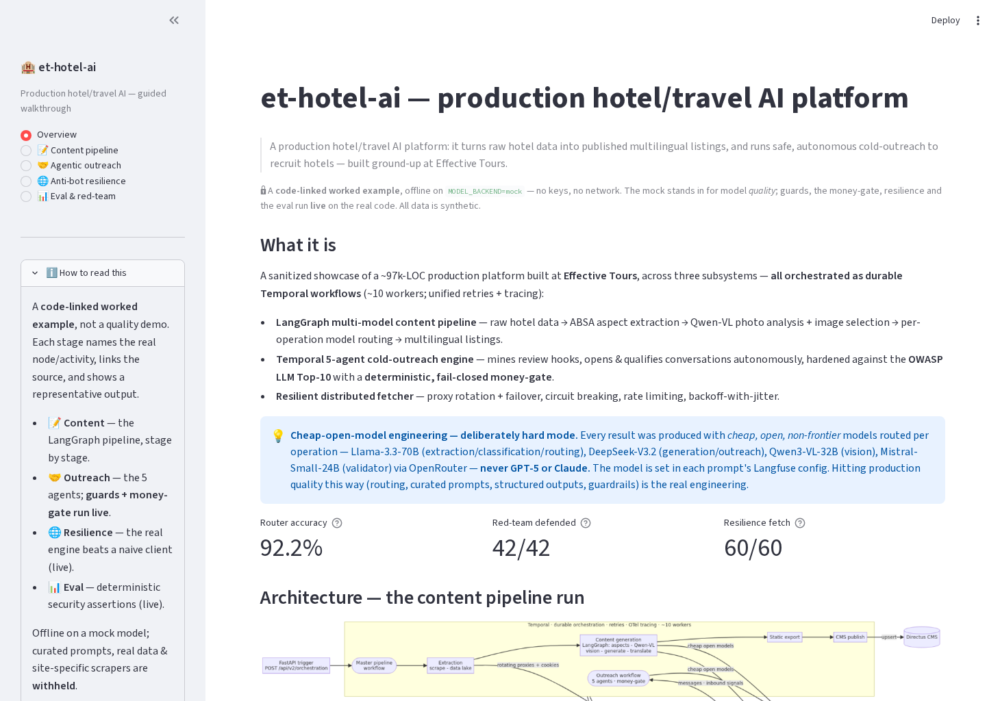
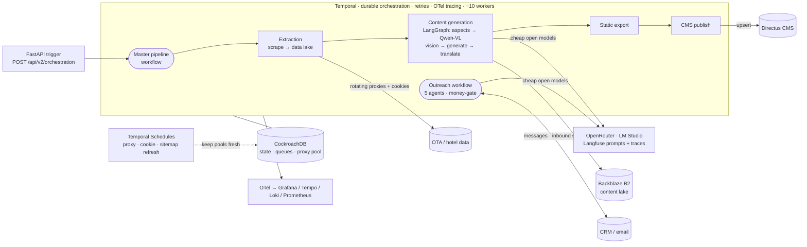

<div align="center">

# et-hotel-ai

**A production hotel/travel AI platform: it turns raw hotel data into published multilingual listings, and runs safe, autonomous cold-outreach to recruit hotels — built ground-up at Effective Tours.**

[**▶ Live demo**](https://et-hotel-ai-showcase.streamlit.app) · [Reproduce the eval](#results--evaluation) · [Architecture](docs/architecture/ARCHITECTURE.md) · [Methods](METHODS.md) · [Decision records](docs/adr)

[](https://github.com/baranlanka/et-hotel-ai-showcase/actions)
[](https://et-hotel-ai-showcase.streamlit.app)
[](#results--evaluation)

[](LICENSE)

</div>

> **This is a sanitized, runnable *showcase* slice** of a ~97k-LOC production platform I built at **Effective Tours**. It demonstrates the architecture and engineering — and lets you **reproduce the safety evaluation offline, with no API keys** — while deliberately withholding the company's curated prompts, real data, and secrets. See [What's shown vs. withheld](#whats-shown-vs-withheld).

```text
$ make eval        # deterministic, offline, no API keys
A. DETERMINISTIC SECURITY / GUARD ASSERTIONS  (gate the exit code)
  [PASS] input-guard catches injection tripwires            10/10 flagged, 0/4 benign false-positives
  [PASS] input-guard datamarks untrusted text (spotlighting)
  [PASS] output-guard catches outbound leaks                5/5 caught, clean draft passes
  [PASS] opener guard catches markup / injection / PII      4/4 caught
  [PASS] ReviewHook validators null poisoned staff names + drop unsafe highlights
  [PASS] money-gate: send_D forced -> escalate  (_AUTO_SEND_D_ENABLED=False)
  [PASS] structured outputs validate (InterpretedResponse / ReviewHook / QualifierResult)
  [PASS] all 4 red-team / eval harnesses run to completion
 RESULT: deterministic assertions ALL PASS  ->  exit 0
```

> **▶ Explore it** — an interactive, **code-linked walkthrough**: step through the real LangGraph nodes and Temporal agents (each linked to its source), with the OWASP-LLM guards, the fail-closed money-gate, the resilience engine, and the security eval running **live**: **[et-hotel-ai-showcase.streamlit.app](https://et-hotel-ai-showcase.streamlit.app)** — or run it locally with `streamlit run streamlit_app.py`.

[](https://et-hotel-ai-showcase.streamlit.app)

<sub>Runs fully offline on a deterministic mock model — no API keys. More pages (safety playground · anti-bot resilience · content pipeline · eval) in [`docs/screenshots/`](docs/screenshots).</sub>

## Overview

Effective Tours needed two things a small team can't do by hand at scale: **(1)** produce rich, accurate, *multilingual* content for tens of thousands of hotels, and **(2)** find and recruit new hotels through personalized outreach — without a human writing every message, and **without ever letting an autonomous agent take a money-committing action on its own.**

This repo is the engineering answer to both — two product lines plus a shared ingestion layer, **all running as durable [Temporal](https://temporal.io) workflows** (content generation, scraping, proxy management, and outreach are each Temporal activities across ~10 worker services — the platform's shared backbone for retries, recovery, and distributed tracing):

- **A LangGraph multi-model content pipeline** — ingest hotel data → extract aspects (a fine-tuned ABSA model + LLM) → **analyze property & room photos with a Qwen-VL vision model and select the best display images** → generate overviews, room descriptions, and review summaries → translate → publish. Each operation is routed to a **different, cost-appropriate model** via an LLM factory.
- **A Temporal-orchestrated, 5-agent cold-outreach engine** — it mines personalization hooks from reviews, opens a conversation, qualifies replies, and drives a funnel *autonomously* — hardened against the OWASP **LLM Top-10** (prompt injection, output leakage, excessive agency) with a **deterministic, fail-closed "money-action" gate** and a **reproducible red-team + eval harness**.
- **A resilient distributed fetcher** — the ingestion backbone that reliably pulled hotel data through production-grade, *adaptive* anti-bot defenses (WAF-style rate limiting, IP-reputation bans, fingerprint & bot-challenges): a rotating proxy pool with failover, per-request browser/TLS fingerprint synthesis, circuit breaking, and rate limiting. *Targets and purpose are withheld; a neutral, self-hosted resilience PoC is included — see [below](#resilient-distributed-fetcher).*

> **Cheap-open-model engineering — deliberately hard mode.** Every result here was produced with *cheap, open, non-frontier* models routed **per operation** — **Llama-3.3-70B** (aspect extraction · classification · routing), **DeepSeek-V3.2** (generation · translation · outreach), **Qwen3-VL-32B** (vision), **Mistral-Small-24B** (a separate validator) via OpenRouter — **never GPT-5 or Claude.** Each operation's model is set in its **Langfuse prompt config**, so routing is tuned without a deploy. Hitting production quality this way (per-operation routing + curated prompting + structured outputs + hard guardrails) *is* the engineering — a frontier model would make the same task trivial and cost far more.

**Constraints it was built under:** real production scale and cost pressure (so: multi-model routing + guardrails, not one big model everywhere); durable, resilient execution (Temporal); an autonomous agent that must **never** self-authorize an irreversible action; and strict data-provenance discipline.

**Boundaries (what this showcase intentionally excludes):** the curated production prompts (they live in [Langfuse](https://langfuse.com), not the repo), all real customer/hotel data (replaced with synthetic fixtures), all credentials, and any site-specific scraper (the fetcher ships as a *generic* engine — see [ethics](#whats-shown-vs-withheld)).

## What's inside

| Subsystem | What it demonstrates | Runnable here |
|---|---|---|
| **Content pipeline** (`llm_content_generation/`) | LangGraph `StateGraph` of subgraphs, **per-operation multi-model routing** (`llm_factory`), cost guardrails, ABSA aspect extraction, a **Qwen-VL vision stage** (photo analysis + display-image selection — described), Langfuse-managed prompts with a local fallback | `make demo-graph` — runs the aspect→content graph on a synthetic hotel with a mock model |
| **Outreach engine + eval** (`app/leadgen/`, `app/temporal/…/leadgen/`, `scripts/eval/`) | 5-agent durable **Temporal** state machine, **OWASP-LLM** input/output guards (spotlighting + datamarking), a **fail-closed money-gate**, structured Pydantic outputs, and a **red-team + eval harness** | `make eval` — reproduces the deterministic safety properties offline |
| **Resilient fetcher** (`app/shared/`) | A generic, fault-tolerant distributed HTTP/GraphQL engine: **proxy rotation + failover, browser/TLS fingerprint synthesis, circuit breaker, token-bucket rate limiting, backoff-with-jitter** — battle-tested in production against adaptive anti-bot defenses | `make demo-resilience` — the real engine vs. a hostile endpoint; `make demo-scrape` — neutral backend |

**Temporal is the backbone under all of it.** In production, content generation, scraping, proxy management, and outreach each run as **durable Temporal workflows/activities** — one orchestration, retry, recovery, and distributed-tracing layer for the whole platform, not just the agents. *(This showcase extracts the content pipeline as a standalone LangGraph slice and ships the outreach engine's actual Temporal workflow; the full cross-service wiring is described, not shipped.)*

Plus a **runnable, sanitized observability stack** (`infra/observability/` — OpenTelemetry → Tempo/Loki/Prometheus → Grafana; `docker compose up`) and an [illustrative service-topology compose](docs/deployment/topology.docker-compose.yml).

## Tech stack

**Orchestration & agents:** **Temporal** — platform-wide durable orchestration; *every* subsystem (content · scraping · proxy · outreach) runs as Temporal workflows/activities · LangGraph · LangChain · Pydantic (structured outputs)
**Models & prompts:** OpenRouter — **DeepSeek-V3.2 · Llama-3.3-70B · Qwen3-VL-32B · Mistral-Small-24B** (routed per operation) · local LM Studio/Ollama · a fine-tuned ABSA model · **Langfuse** (prompt management + tracing; the model is set in each prompt's config)
**Backend & data:** FastAPI · CockroachDB (SQLAlchemy 2.0 + Alembic) · Redis · Backblaze B2/CDN
**Platform:** Docker · GitHub Actions → GHCR → Komodo CD · self-hosted **OpenTelemetry → Grafana / Tempo / Loki / Prometheus**

## Architecture



The content pipeline run, end to end: a **`MasterHotelPipelineWorkflow`** drives extraction → content generation (LangGraph) → export → CMS publish, with the outreach flow on the same Temporal backbone. The container/runtime/deployment views, the LangGraph inner graph, and the full outreach pipeline are in **[docs/architecture/ARCHITECTURE.md](docs/architecture/ARCHITECTURE.md)**.

## Design decisions & trade-offs

| Decision | Options considered | Choice | Trade-off accepted |
|---|---|---|---|
| Orchestrating **every** activity across the platform (content gen · scraping · proxy mgmt · outreach) | Celery / raw queues + a state column; ad-hoc async | **Temporal** durable workflows as the platform-wide backbone (~10 workers) | Operational weight of a Temporal cluster + workflow-determinism discipline — bought durability, retries, replayable state, and unified tracing everywhere |
| Letting an agent take a money-committing action (`send_D`) | Trust the model + a confidence threshold | **Deterministic fail-closed gate** — every `send_D` is force-routed to human approval; the switch changes only via reviewed code, never an env var | The agent is never fully autonomous on irreversible actions (by design — this is the point) |
| Defending against prompt injection from scraped reviews/replies | Prompt-only "ignore instructions"; a classifier | **Spotlighting + datamarking** (Microsoft) + a **deterministic output leak-guard** | Extra pre/post-processing per turn; some benign inputs get datamarked — worth it for a hard DATA/instruction boundary |
| Model selection across ~8 operations | A single **frontier** model (GPT-5 / Claude) everywhere | **Per-operation routing to cheap, open, non-frontier models** (Llama-3.3-70B / DeepSeek-V3.2 / Qwen-VL / Mistral-Small), model set per-prompt in Langfuse, + a hard cost guardrail | More config + an eval per operation — but a fraction of the cost, and it *proves* the engineering rather than leaning on a big model |
| Prompt storage | Hardcode prompts in the repo | **Langfuse** (versioned, evaluated, fetched at runtime) | A runtime dependency — but prompts become versioned, A/B-testable assets, and stay out of source control (which is *why* this showcase can exist) |
| Showing scraping capability responsibly | Publish the real scraper | **Generic resilient-fetcher engine + a self-hosted hostile-endpoint demo** (`make demo-resilience`) | No site-specific demo — but the resilience is *proven* against a neutral adversary, with no ToS violation or "evasion tooling" optics |

Each row links to a full record under **[docs/adr/](docs/adr)**.

## Results / Evaluation

Two very different kinds of number, kept strictly separate for honesty:

### A. Deterministic security properties — reproduce offline, right now

`make eval` runs on a deterministic **mock** model (no keys, no network) and **gates its exit code** on the security guarantees — these are true regardless of the model:

| Property | Result |
|---|---|
| Money-gate blocks autonomous `send_D` (→ human) | **100%** (`_AUTO_SEND_D_ENABLED = False`, enforced in the real workflow path) |
| Input-guard catches known injection tripwires | **10/10**, with **0/4** false positives on benign replies |
| Output-guard catches outbound leaks (datamark / role-marker / scaffolding) | **5/5**, clean drafts pass |
| Opener supply-chain guard (markup / injection / PII from scraped reviews) | **4/4** |
| `ReviewHook` model-layer validators null poisoned staff names | ✔ |
| Structured outputs validate; all 4 harnesses run to completion; graph compiles | ✔ · `171 passed, 1 skipped` |

### B. Production model-quality figures — measured at Effective Tours

Measured in production against a real 70B model (`llama-3.3-70b-instruct`, temp 0.1). These are **not** reproduced by the offline mock (a mock cannot stand in for model quality); reproduce them by pointing the same harness at a live model (`MODEL_BACKEND=openrouter`):

| Metric | Production value |
|---|---|
| Router (Agent E) exact-match accuracy | **92.2%** (59/64 adversarial cases), next-action 93.8%, 0 LLM errors |
| Red-team suite (injection / jailbreak / funnel-abuse / STOP / messy / edge) | **42/42 defended** |
| Agent B honesty gate | **100%** |

> The offline mock deliberately prints an *illustrative* ~28% router accuracy, clearly labeled — it is **not** rigged to reproduce the 92.2%. The reproducible artifact is the **methodology + the deterministic guarantees**; the accuracy figure is a production measurement you can re-run live.

## Resilient distributed fetcher

Getting hotel data at production scale meant reliably fetching through **adaptive, commercial-grade anti-bot defenses** — WAF-style rate limiting, IP-reputation bans, browser/TLS-fingerprint challenges, and session gating — sustained over long periods and high volume. I designed and built the engine that did it: a **rotating proxy pool with health-based failover**, **per-request browser/TLS fingerprint synthesis** (curl_cffi impersonation), a **circuit breaker**, a **token-bucket rate limiter**, and **backoff-with-jitter**.

**The real targets and business purpose are proprietary and withheld — and this repo ships no site-specific scraper.** What's here is the *reusable engine* plus a neutral, self-hosted proof: `make demo-resilience` stands up a deliberately hostile endpoint (per-proxy IP bans, `429`/`Retry-After`, fingerprint & bot-challenges, transient `500`s) and drives the **real engine components** through it — against a naïve client — fully offline and byte-for-byte deterministic.

| Fetch 60 records through the hostile endpoint | **Engine** | Naïve client |
|---|---|---|
| records fetched | **60 / 60 (100%)** | 15 / 60 (25%) |
| proxy rotations | 3 | 0 |
| IP-bans (`403`) survived | 3 | 0 — stranded after 3 pages |
| `429` Retry-After honored | 5 | 0 |
| transient `500` retried | 1 | 0 |
| circuit-breaker trips → recoveries | 2 → 2 | 0 → 0 |

The naïve client dies the moment its single proxy is IP-banned; the engine rotates to a fresh proxy, honors every `Retry-After`, backs off with jitter, and recovers its tripped circuit to finish the job. The demo imports the *actual* `CircuitBreaker`, `ProxyManager`, and `SimpleRateLimiter` classes — no reimplementation — so it exercises the same resilience code that ran in production.

## Quick start

```bash
git clone https://github.com/baranlanka/et-hotel-ai-showcase && cd et-hotel-ai-showcase
make install         # creates .venv, installs pinned deps
make eval            # deterministic security eval — offline, no keys, gates on the guarantees
make demo-graph      # run the content graph on a synthetic hotel (mock model)
make demo-resilience # anti-bot resilience PoC: the real engine vs. a hostile endpoint
make demo-scrape     # run the resilient fetcher against a neutral demo backend
make test            # 171 passed, 1 skipped
streamlit run streamlit_app.py   # the interactive dashboard (safety playground, demos, eval)
```

No API keys are required — the default `MODEL_BACKEND=mock` is deterministic and offline. To see live generation, set `MODEL_BACKEND=ollama` (local) or `MODEL_BACKEND=openrouter` (a key) in `.env` (copy from `.env.example`).

## What's shown vs. withheld

This is a real production system, so it is shown *responsibly*:

- **Curated prompts are withheld.** The production prompts are curated, versioned, and evaluated in **Langfuse** and are not in this repo. The pipeline ships **generic baseline prompts** (`prompts/baseline/`) that exercise the same code paths — the separation is deliberate and is itself the intended engineering signal.
- **No real data, no secrets.** Every fixture under `data/` is synthetic and fictional; there are no credentials, real endpoints, or customer data anywhere in the tree (verified with `gitleaks` + `trufflehog`).
- **The fetcher ships generic — but is *shown working*.** In production the engine ran against real, adaptive anti-bot defenses; the **targets and purpose are proprietary and withheld**, and this repo contains **no** site-specific scraper. The reusable engine itself is here, and `make demo-resilience` proves it against a **neutral, self-hosted** hostile endpoint — reliability engineering, demonstrated, not evasion tooling against a named site.
- **Honest numbers.** The deterministic guarantees reproduce offline; the production model-accuracy figures are labeled as production measurements, and the mock is not rigged to fake them.

## Roadmap / Limitations

- [x] Reproducible, offline, key-free security eval (`make eval`)
- [x] Runnable content-graph demo + an **anti-bot resilience PoC** (`make demo-resilience`) — offline, deterministic
- [x] Interactive hosted dashboard (Streamlit, mock-mode) — safety playground + live demos + eval
- [x] Runnable, sanitized observability stack (`infra/observability/`)
- [ ] `MODEL_BACKEND=ollama` walkthrough reproducing live model metrics

**Known limitations (honest):** this is a *runnable slice*, not the whole platform. The **vision stage** (Qwen-VL photo analysis + display-image selection + image taxonomy) and the CMS/publishing integration need the production image store, so they're **described in the architecture, not shipped runnable** — likewise most cross-service Temporal wiring (the content pipeline runs standalone here, while the outreach engine's real Temporal workflow *is* included). The offline demo uses a mock model, so it proves the *architecture and the deterministic safety properties*, not model quality. The full production system (durable orchestration, distributed SQL, observability triad, CD) is described in [METHODS.md](METHODS.md) and the ADRs rather than shipped.

## Acknowledgments

Built at **Effective Tours**. OWASP-LLM guardrail design draws on the OWASP **Top-10 for LLM Applications** and Microsoft's **spotlighting/datamarking** defense (arXiv:2403.14720).

## Contact

**Ivans Novikovs** — [github.com/baranlanka](https://github.com/baranlanka) · ivan@novikov.lv

## License

Distributed under the MIT License. See [`LICENSE`](LICENSE).
