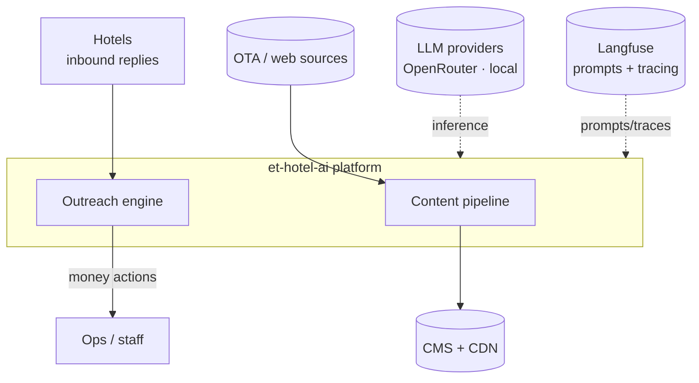
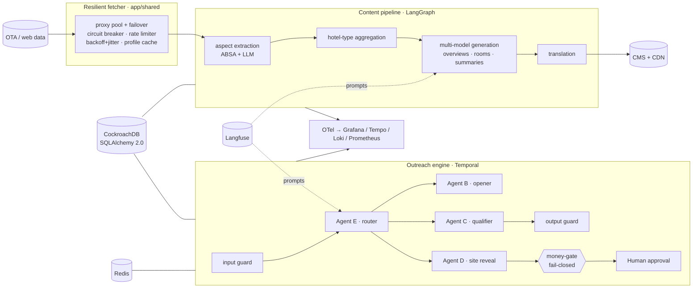
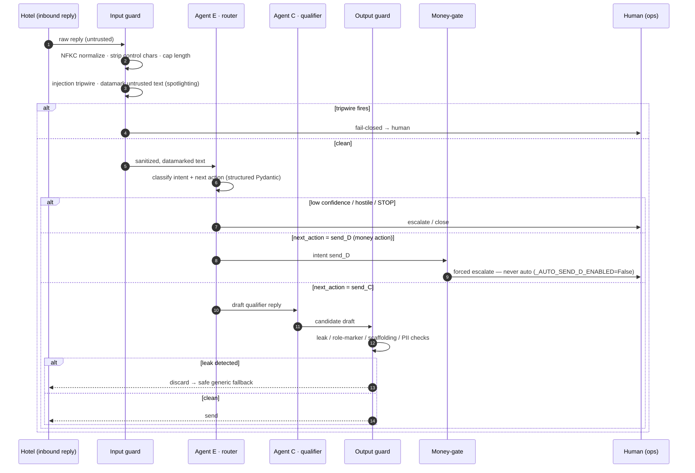
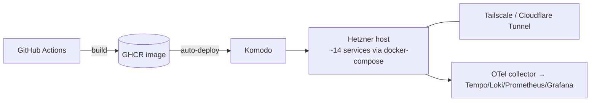

# Architecture

A deeper view of the platform than the README. Diagrams are native Mermaid (they render on GitHub and diff cleanly). This document describes the **production** system built at Effective Tours; the public repo ships a sanitized, runnable slice of it (see [what's withheld](../../README.md#whats-shown-vs-withheld)).

## 1. System context

The platform sits between raw hotel data and two outputs: **published listings** and **outreach conversations**.

## 2. Container view

Ten worker services around a durable core. The showcase extracts the two agentic subsystems + the fetcher; the rest (publishing, storage, CD) is described, not shipped.

## 3. Runtime view — the 5-agent outreach turn

The security-critical path. Every inbound hotel reply is untrusted input; the router fires first on every turn, and the money action can never be taken autonomously.

**Defense layers on that path**

1. **Input guard** (`app/leadgen/outreach/input_guard.py`, stdlib-only): Unicode normalization, control-char stripping, a 4 KB cap (LLM10 unbounded-consumption), a narrow high-precision injection **tripwire**, role/structure-marker neutralization, and **datamarking** — interleaving a marker through untrusted text so the model can separate DATA from instructions ([Microsoft spotlighting, arXiv:2403.14720](https://arxiv.org/abs/2403.14720)).
2. **Output guard** (`output_guard.py`, stdlib-only): a deterministic leak check between draft and send — catches datamark echoes, role markers, internal scaffolding phrases, and the review supply-chain vector (markup / injection vocab / PII smuggled via scraped reviews). On any hit: discard and fall back to a safe generic phrase.
3. **Money-gate** (`outreach_conversation_workflow.py`): `_AUTO_SEND_D_ENABLED = False` — a hard constant, changeable only via reviewed code, that force-routes every money action to human approval. Plus a router-confidence floor and a per-conversation flood cap.
4. **Model-layer validators** (`ReviewHook`): poisoned staff names and unsafe highlights are nulled at the Pydantic boundary, before any prompt sees them.

## 4. Deployment view (production)

A single image serves the whole stack; ~10 worker services (booking, content, outreach, dispatcher, proxy, cookie, poller…) run against CockroachDB + Redis, with Temporal for durable orchestration and a full self-hosted observability triad. CI gates on ruff, a forward-only mock-ratchet, and pre-commit.

## 5. Key module map (showcase)

| Path | Role |
|---|---|
| `llm_content_generation/et_langgraph/graph.py` | Content `StateGraph` factory (trimmed aspect→content slice here) |
| `llm_content_generation/services/llm_factory.py` | Per-operation multi-model routing + cost guardrail + `MODEL_BACKEND` switch |
| `llm_content_generation/core/langfuse_prompts.py` | Runtime prompt fetch with a baseline fallback when Langfuse is off |
| `app/leadgen/outreach/{input,output}_guard.py` | OWASP-LLM guards (stdlib-only) |
| `app/temporal/workflows/leadgen/outreach_conversation_workflow.py` | The durable 5-agent state machine + money-gate |
| `app/temporal/activities/leadgen/` | The five agents (router, opener, qualifier, miner, …) |
| `scripts/eval/run_outreach_*.py` | Red-team + eval harnesses |
| `app/shared/graphql_processing/`, `app/shared/scraping/` | Generic resilient fetcher engine (proxy rotation, circuit breaker, rate limiter, fingerprinting) |
| `scripts/demo/demo_resilience.py` + `hostile_endpoint.py` | Anti-bot resilience PoC — drives the real engine through a self-hosted hostile endpoint (`make demo-resilience`) |

See [METHODS.md](../../METHODS.md) for the evaluation methodology and [docs/adr/](../adr) for the decision records.
