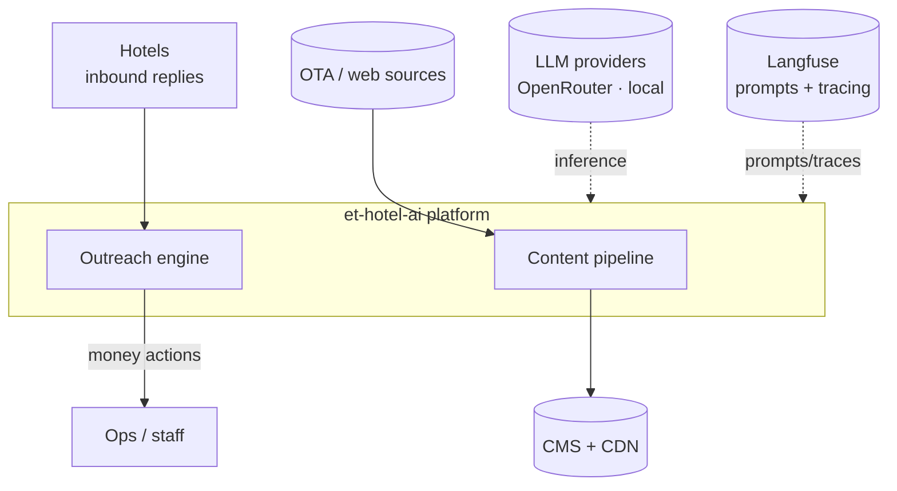
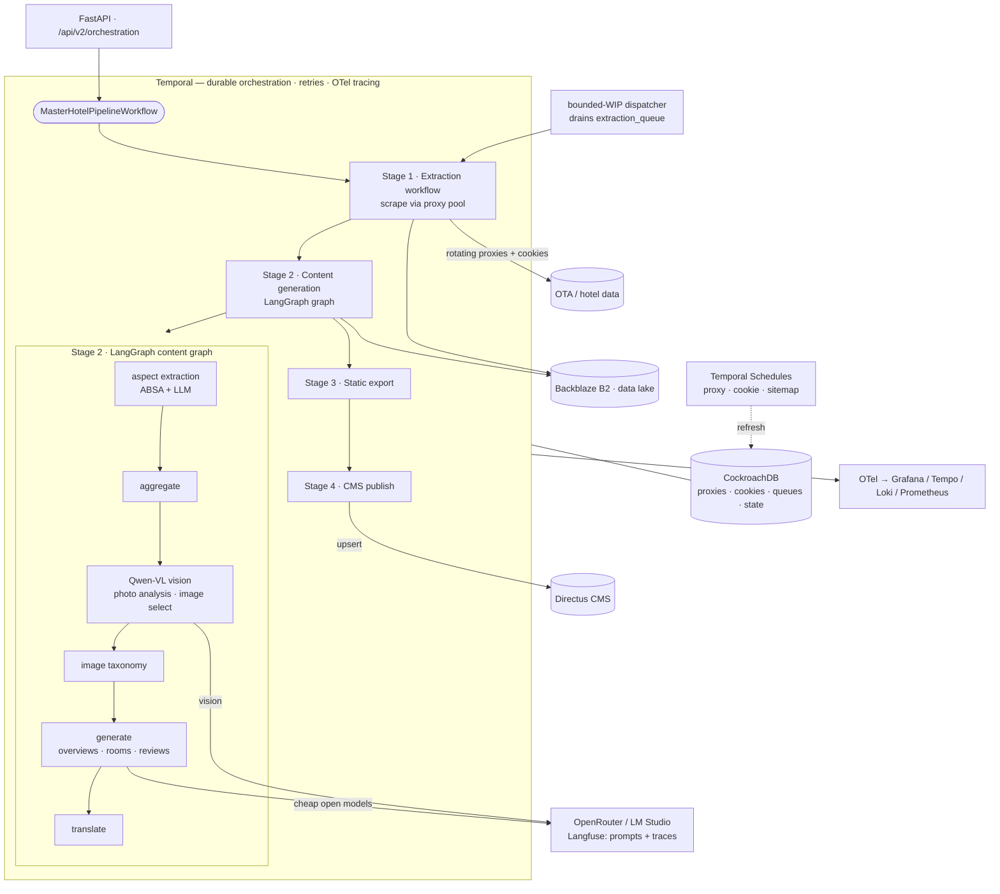
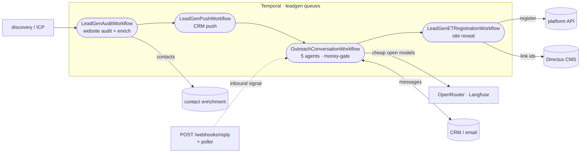
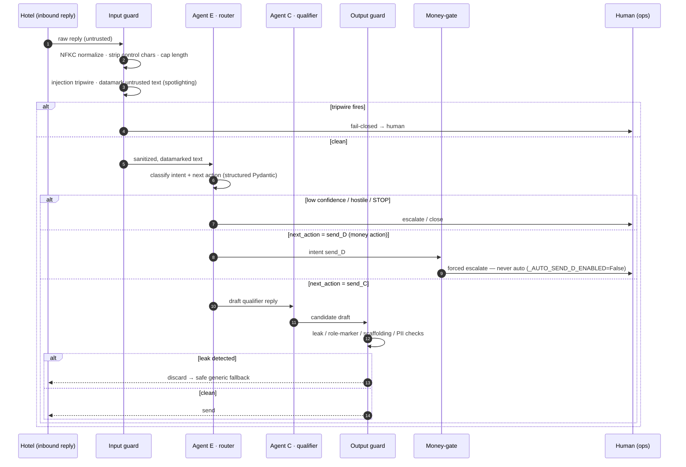
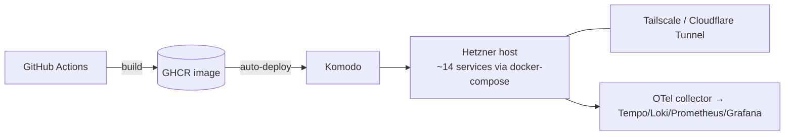

# Architecture

A deeper view of the platform than the README. Diagrams are native Mermaid (they render on GitHub and diff cleanly). This document describes the **production** system built at Effective Tours; the public repo ships a sanitized, runnable slice of it (see [what's withheld](../../README.md#whats-shown-vs-withheld)).

## 1. System context

The platform sits between raw hotel data and two outputs: **published listings** and **outreach conversations**.

## 2. Pipeline runs

**Every subsystem runs as durable Temporal workflows/activities across ~10 worker services** — one retry/recovery/tracing spine for the whole platform. The headline is the **content pipeline run**: a `MasterHotelPipelineWorkflow` executes child workflows sequentially across task queues (stages 1–2 required, 3–4 best-effort → `partial_success`), while maintenance **Temporal Schedules** (proxy / cookie / sitemap) keep the shared CockroachDB pools fresh and a **bounded-WIP dispatcher** fans the pipeline out over thousands of hotels.

### Content pipeline run

Stages: **1 Extraction** (scrape → raw JSON + images to B2; a fail-loud zero-record gate re-queues suspected soft-blocks) → **2 Content generation** (the LangGraph graph above; a CP0 idempotency probe short-circuits if a bundle already exists, saving LLM cost) → **3 Static export** (per-language SEO/meta JSON) → **4 CMS publish** (health → validate dry-run → upsert → verify). Every LLM/vision call goes through the `llm_factory` to **cheap open models** on OpenRouter (or local LM Studio), prompts + traces in Langfuse; all artifacts land in Backblaze B2; the scrape stage leases rotating proxies + cookies from the CockroachDB pool.

### Outreach pipeline run

Lead discovery feeds an audit queue; `LeadGenAuditWorkflow` scores the hotel's website (deterministic, no LLM) and enriches contacts; the lead is pushed to the CRM; `OutreachConversationWorkflow` then runs the durable 5-agent conversation (30-day timeout, `continue_as_new` past ~500 history events). Inbound replies arrive by webhook or poller and are delivered as **Temporal signals** after input-guard sanitizing; the money action (site reveal) is human-gated in the pilot.

## 3. Runtime view — the 5-agent outreach turn

The security-critical path. Every inbound hotel reply is untrusted input; the router fires first on every turn, and the money action can never be taken autonomously.

**Defense layers on that path**

1. **Input guard** (`app/leadgen/outreach/input_guard.py`, stdlib-only): Unicode normalization, control-char stripping, a 4 KB cap (LLM10 unbounded-consumption), a narrow high-precision injection **tripwire**, role/structure-marker neutralization, and **datamarking** — interleaving a marker through untrusted text so the model can separate DATA from instructions ([Microsoft spotlighting, arXiv:2403.14720](https://arxiv.org/abs/2403.14720)).
2. **Output guard** (`output_guard.py`, stdlib-only): a deterministic leak check between draft and send — catches datamark echoes, role markers, internal scaffolding phrases, and the review supply-chain vector (markup / injection vocab / PII smuggled via scraped reviews). On any hit: discard and fall back to a safe generic phrase.
3. **Money-gate** (`outreach_conversation_workflow.py`): `_AUTO_SEND_D_ENABLED = False` — a hard constant, changeable only via reviewed code, that force-routes every money action to human approval. Plus a router-confidence floor and a per-conversation flood cap.
4. **Model-layer validators** (`ReviewHook`): poisoned staff names and unsafe highlights are nulled at the Pydantic boundary, before any prompt sees them.

## 4. Deployment view (production)

A single image serves the whole stack; ~10 worker services (extraction, content, outreach, dispatcher, proxy, cookie, poller…) run against CockroachDB + Redis, with Temporal for durable orchestration and a full self-hosted observability triad. CI gates on ruff, a forward-only mock-ratchet, and pre-commit.

A **runnable, sanitized slice** of that observability triad ships in [`infra/observability/`](../../infra/observability/) (`docker compose up` → Grafana with the dashboards + datasources pre-wired), and a sanitized sketch of the full service graph is in [`docs/deployment/topology.docker-compose.yml`](../deployment/topology.docker-compose.yml).

## 5. Key module map (showcase)

| Path | Role |
|---|---|
| `llm_content_generation/et_langgraph/graph.py` | Content `StateGraph` factory (trimmed aspect→content slice here) |
| `llm_content_generation/services/llm_factory.py` | Per-operation multi-model routing + cost guardrail + `MODEL_BACKEND` switch |
| `llm_content_generation/core/langfuse_prompts.py` | Runtime prompt fetch with a baseline fallback when Langfuse is off |
| `app/leadgen/outreach/{input,output}_guard.py` | OWASP-LLM guards (stdlib-only) |
| `app/temporal/workflows/leadgen/outreach_conversation_workflow.py` | The durable 5-agent state machine + money-gate |
| `app/temporal/activities/leadgen/` | The five agents (router, opener, qualifier, miner, …) |
| `scripts/eval/run_outreach_*.py` | Red-team + eval harnesses |
| `app/shared/graphql_processing/`, `app/shared/scraping/` | Generic resilient fetcher engine (proxy rotation, circuit breaker, rate limiter, fingerprinting) |
| `scripts/demo/demo_resilience.py` + `hostile_endpoint.py` | Anti-bot resilience PoC — drives the real engine through a self-hosted hostile endpoint (`make demo-resilience`) |
| `infra/observability/` | Runnable, sanitized telemetry stack — OTel Collector → Tempo/Loki/Prometheus → Grafana (`docker compose up`); see its [README](../../infra/observability/README.md) |

See [METHODS.md](../../METHODS.md) for the evaluation methodology and [docs/adr/](../adr) for the decision records.
